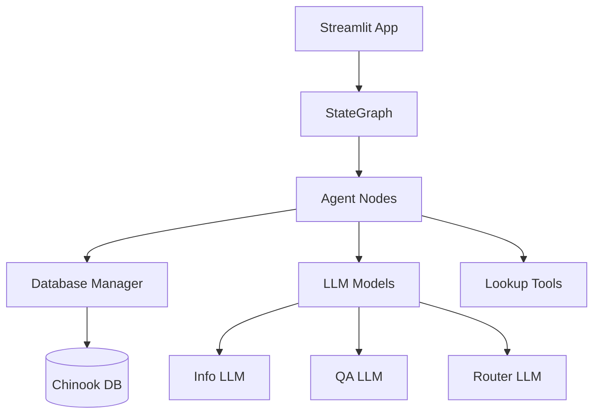
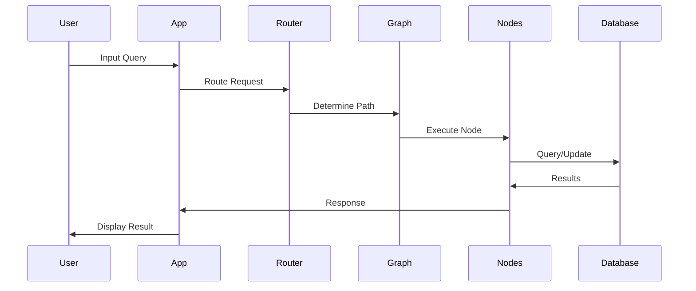

# Music Store Customer Support Chatbot - System Structure

## 1. Project Structure
```
agent_customer_support/
├── src/
│   ├── app.py                 # Streamlit interface and main entry point
│   ├── main.py               # Graph construction and model initialization
│   ├── __init__.py           # Package initialization
│   │
│   ├── agents/               # Agent components
│   │   └── agent_nodes.py    # Core agent node implementations
│   │
│   ├── models/               # Data models and types
│   │   └── types.py         # Type definitions and state schemas
│   │
│   ├── database/            # Database management
│   │   ├── db_manager.py    # Database connection and query handling
│   │   └── db_operations.py # Core database operations
│   │
│   ├── tools/               # Tool implementations
│   │   └── lookup_tools.py  # Music catalog lookup tools
│   │
│   └── utils/               # Utility functions
│       ├── config.py        # Configuration and environment setup
│       └── graph_utils.py   # Graph-related utilities
│
├── .streamlit/              # Streamlit configuration
├── chinook.db              # SQLite database
├── requirements.txt        # Project dependencies
├── setup.py               # Package setup
└── questions.md           # Example queries and test cases
```

## 2. Component Interactions


## 3. Data Flow

### 3.1 User Input Processing


## 4. Component Details

### 4.1 State Management
```python
State = {
    "messages": List[Message],     # Conversation history
    "followup": Optional[str],     # Response to show user
    "invoice_id": Optional[int],   # For refunds
    "customer_info": Dict,         # Customer details
    "next": str                    # Next node in graph
}
```

### 4.2 Core Components

#### 4.2.1 Agent Nodes
- **Router Node**: Determines user intent (refund/music query/general)
- **Info Node**: Extracts purchase information
- **Music Query Node**: Handles music catalog searches
- **Refund Node**: Processes refund requests

#### 4.2.2 Database Operations
- Customer lookup
- Purchase history
- Music catalog search
- Refund processing

#### 4.2.3 LLM Integration
- **Models Used**: Gemini-1.5-flash
- **Purposes**:
  - Intent classification
  - Information extraction
  - Response generation
  - Music recommendations

## 5. Key Workflows

### 5.1 Refund Process
1. Customer provides information
2. System validates identity
3. Lookup purchases
4. Process refund
5. Confirm completion

### 5.2 Music Query Process
1. Parse search criteria
2. Query music catalog
3. Format results
4. Provide recommendations
5. Handle follow-up questions

## 6. Configuration Management

### 6.1 Environment Variables
```python
Required:
- GOOGLE_API_KEY        # For Gemini LLM
- LANGCHAIN_API_KEY     # For LangChain/Smith
- LANGCHAIN_PROJECT     # Project tracking
- LANGCHAIN_TRACING_V2  # Enable tracing
```

### 6.2 Database Schema
Core tables used:
- Customer
- Invoice
- InvoiceLine
- Track
- Album
- Artist

## 7. Error Handling

### 7.1 Graceful Degradation
1. LLM timeout fallbacks
2. Database connection retries
3. Invalid input handling
4. Context preservation

### 7.2 User Experience
1. Clear error messages
2. Guided recovery steps
3. Context maintenance
4. Progress preservation

## 8. Testing & Evaluation

### 8.1 Test Scenarios
Detailed in `questions.md`:
- Catalog queries
- Refund requests
- Mixed intents
- Edge cases

### 8.2 Metrics
- Response accuracy
- Task completion
- Conversation coherence
- Error recovery

## 9. Future Enhancements

### 9.1 Potential Improvements
1. Additional music metadata
2. Enhanced recommendations
3. Multi-language support
4. Transaction history
5. User preferences

### 9.2 Scalability
1. Cache implementation
2. Query optimization
3. Connection pooling
4. State management
5. Async operations 